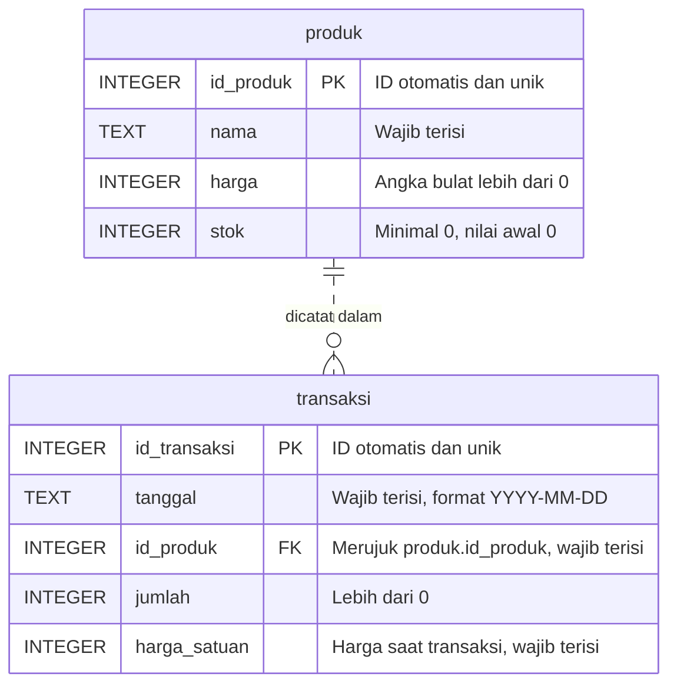

# Panduan Praktik dan Latihan Minggu 6

**Mata kuliah:** Pemograman Bisnis & Perancangan Sistem Administrasi  
**Topik:** ERD, basis data SQLite, dan operasi CRUD dari Python melalui aplikasi Streamlit

> Skrip yang dibagikan adalah bahan awal praktik, bukan tugas yang sudah selesai. Yang harus dibuktikan bukan hanya program berjalan, tetapi juga pemahaman hubungan tabel serta hasil pengelolaan datanya.

## 1. Bahan yang digunakan

| File | Kegunaan |
|---|---|
| [Slide materi](minggu-06-slide-basis-data-sqlite-crud.pptx) | Pengantar ERD, SQLite, dan CRUD. |
| [Lembar kerja PDF](minggu-06-lembar-kerja-sqlite-crud.pdf) | Teori, langkah kerja, dan tabel pencatatan hasil. |
| [Lembar kerja Word](minggu-06-lembar-kerja-sqlite-crud.docx) | Versi yang dapat diisi secara digital. |
| [Outline materi](minggu-06-outline-basis-data-sqlite-crud.md) | Alur dan contoh materi dua pertemuan. |
| [kode-praktik/buat_database.py](kode-praktik/buat_database.py) | Membuat database, dua tabel berelasi, dan data awal. |
| [kode-praktik/uji_aturan.py](kode-praktik/uji_aturan.py) | Menguji aturan harga serta penjaga hubungan antartabel. |
| [6.2/kode-praktik/database.py](6.2/kode-praktik/database.py) | Fungsi koneksi dan CRUD produk; `hapus_produk()` dilengkapi mahasiswa (pertemuan 2). |
| [6.2/kode-praktik/app.py](6.2/kode-praktik/app.py) | Aplikasi Streamlit awal: tampil dan tambah sudah jadi; ubah harga dan hapus dilengkapi mahasiswa (pertemuan 2). |
| [Folder 6.2](6.2/README.md) | Seluruh bahan pertemuan 2: script `kode-praktik`, slide, dan lembar kerja. |
| [Slide pertemuan 2](6.2/minggu-06-pertemuan-2-slide-crud-streamlit.pptx) | Slide khusus CRUD lewat aplikasi Streamlit. |
| [Lembar kerja pertemuan 2 (Word)](6.2/minggu-06-pertemuan-2-lembar-kerja-crud-streamlit.docx) · [PDF](6.2/minggu-06-pertemuan-2-lembar-kerja-crud-streamlit.pdf) | Bagian B (B1–B5) saja, dengan persiapan khusus Selasa. |

Seluruh teori ERD yang dibutuhkan tersedia pada bahan Minggu 6. **Tidak perlu membuka kembali modul Minggu 3.**

## 2. Persiapan dan cara mengambil file

1. Di halaman repository GitHub, pilih **Code → Download ZIP**, kemudian ekstrak ZIP. Jangan menjalankan file dari dalam ZIP.
2. Buka folder **Minggu ke-6** untuk membaca bahan ajar. Buat folder kerja terpisah bernama **minggu-06** agar bahan awal dan pekerjaan sebelumnya tetap aman.
3. Salin `buat_database.py` dan `uji_aturan.py` dari `kode-praktik` ke folder kerja tersebut. Untuk pertemuan kedua, salin juga `database.py` dan `app.py` dari `6.2/kode-praktik` ke folder kerja yang sama.
4. Buka VS Code → **File → Open Folder**, lalu pilih folder kerja `minggu-06`.
5. Pilih **Terminal → New Terminal**. Pastikan terminal berada di folder yang berisi kedua skrip, bukan di folder induknya.
6. Periksa Python:

```bash
python --version
```

Harus muncul Python 3. Di Windows, gunakan `py --version` jika `python` tidak dikenali. Jika memakai `py`, gunakan `py` juga untuk semua perintah menjalankan skrip berikutnya.

**Tidak perlu memasang SQLite, MySQL, atau XAMPP.** Modul `sqlite3` sudah bawaan Python. SQLite Viewer di VS Code hanya alat bantu opsional.

7. **Sebelum pertemuan kedua**, pasang Streamlit satu kali (perlu internet; lewati jika sudah terpasang sejak Minggu 5):

```bash
python -m pip install streamlit
```

Periksa dengan `python -m streamlit version`. Pemasangan dilakukan di rumah atau sebelum kelas, bukan saat praktik berlangsung.

## 3. Pahami ERD sebelum menjalankan skrip

ERD adalah peta data, bukan urutan kerja program.

- **Entitas** adalah jenis objek/kejadian yang dicatat: `produk` dan `transaksi`.
- **Atribut** adalah keterangannya: `nama`, `harga`, `stok`, dan sebagainya; menjadi kolom tabel.
- **Baris** adalah satu catatan nyata: Buku Tulis merupakan isi tabel `produk`, bukan entitas baru.
- **Primary Key (PK)** adalah identitas unik setiap baris: `produk.id_produk` dan `transaksi.id_transaksi`.
- **Foreign Key (FK)** adalah rujukan: `transaksi.id_produk` menunjuk `produk.id_produk`. Nilai FK boleh berulang karena produk yang sama dapat dibeli beberapa kali.

### Diagram ERD database kasir

Diagram berikut sesuai dengan tabel `produk` yang digunakan oleh fungsi CRUD pada `database.py`. Struktur lengkap tabel dan relasinya mengacu pada `CREATE TABLE` di [`buat_database.py`](kode-praktik/buat_database.py), karena `database.py` mengelola data, bukan mendefinisikan tabel. GitHub menampilkan blok Mermaid ini sebagai diagram.



**Cara membaca diagram:**
- `PK` menandai identitas unik; `FK` menandai rujukan ke tabel lain.
- `||` di sisi `produk` berarti setiap transaksi harus menunjuk **tepat satu produk**.
- `o{` di sisi `transaksi` berarti satu produk dapat memiliki **nol atau banyak transaksi**.
- Garis putus-putus (`..`) berarti identitas transaksi menggunakan PK sendiri (`id_transaksi`), bukan gabungan dengan ID produk.
- Tanggal berformat `YYYY-MM-DD` adalah konvensi pengisian pada contoh; skrip belum memeriksa format tanggal secara otomatis.

**Hubungan dengan `database.py`:** `tambah_produk()` mengisi `nama`, `harga`, dan `stok`; `daftar_produk()` membaca keempat kolom produk; `ubah_harga()` dan `hapus_produk()` memilih baris berdasarkan `id_produk`. `buka_koneksi()` mengaktifkan penjaga FK, sehingga produk yang masih dirujuk transaksi tidak dapat dihapus. Fungsi CRUD transaksi belum disediakan pada modul ini.

Hubungannya **1:N**: satu produk boleh mempunyai **0..N** catatan transaksi; setiap transaksi menunjuk tepat satu produk yang ada. FK diletakkan di sisi banyak, yaitu tabel `transaksi`.

**Batas contoh:** `transaksi` pada skrip ini adalah catatan penjualan satu jenis produk, bukan satu nota lengkap berisi banyak jenis produk. Model nota banyak produk membutuhkan tabel tambahan `detail_transaksi`; model lanjutan tersebut tidak wajib dibuat pada praktik dasar ini.

## 4. Pertemuan pertama: buat database dan uji aturannya

### Langkah 1 — Jalankan skrip pembuat database

```bash
python buat_database.py
```

Hasil yang diharapkan:

```text
Database dan tabel siap.
```

File **`kasir.db`** muncul pada folder kerja. Database baru berisi:

| ID produk | Nama | Harga | Stok |
|---|---|---|---|
| 1 | Buku Tulis | 5000 | 20 |
| 2 | Pulpen | 3000 | 30 |
| 3 | Map Plastik | 2500 | 10 |

Ada satu transaksi yang merujuk Buku Tulis ID 1: tanggal `2026-10-12`, jumlah 2, harga satuan 5000.

Jalankan `buat_database.py` sekali lagi. Pada database baru yang belum diubah, jumlah data awal tetap **tiga produk dan satu transaksi**. `IF NOT EXISTS` mencegah pembuatan ulang tabel; pemeriksaan jumlah produk mencegah pengisian ulang data awal ketika tabel produk sudah berisi data.

> Mengedit definisi `CREATE TABLE IF NOT EXISTS` tidak otomatis mengubah struktur tabel yang sudah ada. Menambahkan tabel baru dapat dilakukan dengan menjalankan ulang skrip. Jika perlu mengulang dari nol, buat folder kerja baru dan jalankan skrip di sana; jangan menghapus database hasil pekerjaan yang belum dicadangkan.

### Langkah 2 — Baca aturan di dalam skrip

| Bagian | Makna |
|---|---|
| `INTEGER PRIMARY KEY AUTOINCREMENT` | ID otomatis untuk membedakan catatan. |
| `NOT NULL` | Nilai tidak boleh kosong (`NULL`); bukan pemeriksaan teks kosong atau spasi. |
| `CHECK (typeof(harga) = 'integer' AND harga > 0)` | Harga harus tersimpan sebagai angka bulat positif. |
| `CHECK (stok >= 0)` | Stok tidak boleh negatif. |
| `FOREIGN KEY ... REFERENCES ...` | Menyatakan hubungan transaksi dengan produk. |
| `PRAGMA foreign_keys = ON` | Mengaktifkan pemeriksaan FK pada koneksi tersebut; tulis pada setiap koneksi aplikasi. |
| `harga_satuan` pada transaksi | Mencatat harga saat penjualan agar perubahan harga produk tidak mengubah nilai transaksi lama. |

### Langkah 3 — Jalankan skrip pengujian

```bash
python uji_aturan.py
```

| Uji | Percobaan | Hasil yang diharapkan |
|---|---|---|
| A | Harga berupa teks `seribu` | **DITOLAK**, dengan pesan `CHECK constraint failed`. |
| B | Transaksi merujuk produk ID 999 yang tidak ada, FK aktif | **DITOLAK**, dengan pesan `FOREIGN KEY constraint failed`. |
| C | Percobaan seperti B, tetapi koneksi tanpa mengaktifkan FK | **DITERIMA** pada lingkungan SQLite standar dengan FK bawaan nonaktif. |

Hasil penolakan A dan B adalah bukti aturan bekerja, bukan tanda skrip rusak. Uji C adalah demonstrasi bahaya jika penjaga relasi tidak diaktifkan, **bukan pola yang boleh dipakai pada aplikasi**. Skrip menjalankan `rollback()` untuk membatalkan data uji yang sempat masuk. Gunakan database latihan awal agar produk ID 999 memang belum ada. Jika C ditolak, catat hasil aktual dan diskusikan konfigurasi FK lingkungan Anda; jangan memalsukan hasil agar sama dengan contoh.

Salin keluaran asli ke tabel **A4** pada lembar kerja.

## 5. Latihan wajib pertemuan pertama

### Latihan A — Jelaskan ERD dengan kata-kata sendiri

Jawab pada lembar kerja atau file `jawaban-latihan.md`:

1. Apa perbedaan entitas, atribut, dan isi satu baris? Gunakan contoh Buku Tulis.
2. Mengapa `produk.id_produk` tidak boleh berulang, sedangkan `transaksi.id_produk` boleh berulang?
3. Apa arti hubungan 1:N dan 0..N pada contoh ini? Apakah produk yang belum terjual perlu dibuatkan transaksi kosong?
4. Mengapa FK diletakkan pada tabel `transaksi`?
5. Mengapa `harga_satuan` tetap dicatat pada transaksi meskipun tabel produk sudah mempunyai kolom `harga`?

### Latihan B — Rancang dan tambahkan satu tabel

1. Isi tabel **A1** untuk `produk` dan `transaksi`, lalu rancang satu entitas tambahan untuk tema proyek Anda.
2. Tentukan nama tabel, atribut, tipe data, PK, serta aturan isian yang masuk akal.
3. Tulis satu kalimat yang menjelaskan hubungannya dengan tabel lain. Jika 1:N, tentukan sisi banyak dan letak FK.
4. Tambahkan `CREATE TABLE IF NOT EXISTS ...` di dalam teks SQL pada `buat_database.py`, mengikuti **A3**.
5. Tambahkan data simulasi, lalu buktikan tabel dan datanya dapat dibaca dengan `SELECT`.

**Pilihan contoh yang tidak mengubah struktur tabel lama:** tabel `pergerakan_stok` untuk mencatat penambahan stok produk. Satu produk dapat memiliki banyak catatan pergerakan; setiap catatan menunjuk satu produk. Rancang atribut seperti ID pergerakan, tanggal, ID produk, jumlah masuk, dan keterangan. Tentukan sendiri PK/FK serta aturan nilai yang sesuai. Latihan ini hanya mencatat data; sinkronisasi otomatis dengan kolom stok produk belum diwajibkan.

Untuk tema lain, gunakan pola dua tabel berelasi yang sama. Jika mengganti nama database menjadi `<nama_proyek>.db`, samakan namanya pada seluruh skrip.

### Latihan C — Jelaskan hasil pengujian

1. Jalankan uji A, B, dan C; catat hasil asli.
2. Jelaskan mengapa B dan C dapat berbeda walaupun data yang dicoba sama.
3. Jelaskan akibat data transaksi yang merujuk produk tidak ada terhadap laporan bisnis.
4. Isi refleksi **A5**: mengapa validasi Python dan aturan database sama-sama diperlukan?

## 6. Pertemuan kedua: CRUD dengan aplikasi Streamlit

Pada pertemuan kedua, data dikelola lewat **halaman web Streamlit**, bukan menu terminal. Pekerjaan dibagi menjadi dua file:

| File | Tanggung jawab | Status awal |
|---|---|---|
| `database.py` | Koneksi serta fungsi tambah, tampil, ubah harga, dan hapus produk. Tidak berisi kode Streamlit. | Hampir jadi; `hapus_produk()` dilengkapi. |
| `app.py` | Tampilan: formulir input, tombol, pesan berhasil/gagal, dan tabel produk. | Tampil dan tambah sudah jadi; ubah harga dan hapus dilengkapi. |

`app.py` hanya **memanggil** fungsi `database.py`. Pemisahan ini membuat `database.py` dapat dipakai ulang oleh tampilan apa pun, termasuk aplikasi Minggu 7.

### Cara kerja Streamlit yang perlu dipahami

- Setiap kali tombol ditekan, Streamlit **menjalankan ulang seluruh `app.py` dari atas ke bawah**.
- `st.form(...)` mengelompokkan isian; data baru diproses setelah tombol formulir ditekan.
- `st.number_input(..., step=1)` hanya menerima angka bulat, sehingga isian seperti `abc` tidak bisa diketik. Validasi tetap diperlukan untuk aturan lain, misalnya nama kosong.
- Tabel daftar produk diletakkan **paling bawah** agar dibaca setelah perubahan diproses dan selalu menampilkan data terbaru.
- Pesan ditampilkan dengan `st.success(...)`, `st.warning(...)`, dan `st.error(...)`.

### Jalankan aplikasi awal

Jalankan `buat_database.py` terlebih dahulu jika `kasir.db` belum ada, kemudian:

```bash
python -m streamlit run app.py
```

Browser akan membuka halaman **Kelola Produk**. Jika tidak terbuka otomatis, salin alamat `http://localhost:8501` dari terminal ke browser. Untuk menghentikan aplikasi, klik terminal lalu tekan **Ctrl+C**.

Pada aplikasi awal, tambah produk dan tabel daftar sudah berfungsi. Tombol ubah harga dan hapus masih menampilkan pesan **belum dilengkapi**.

### Latihan D — Lengkapi `hapus_produk()`

1. Buka `database.py` dan pelajari pola `ubah_harga()`.
2. Lengkapi `hapus_produk(id_produk)` mengikuti **B2**: `DELETE FROM produk WHERE id_produk = ?`, parameter satu elemen `(id_produk,)`, `commit()`, kembalikan `cursor.rowcount`, dan tutup koneksi dalam `finally`.
3. Gunakan parameter `?`; jangan merangkai nilai input ke string SQL.
4. Jangan menghapus baris `PRAGMA foreign_keys = ON` di `buka_koneksi()`.

### Latihan E — Lengkapi `app.py`

1. **E1 – Ubah harga:** ganti baris `st.info(...)` pada bagian ubah harga. Panggil `database.ubah_harga(id_ubah, harga_baru)`; tampilkan `st.warning` jika hasilnya 0 (ID tidak ditemukan) dan `st.success` jika berhasil. Tangkap `sqlite3.IntegrityError` dengan `st.error`.
2. **E2 – Hapus:** ganti baris `st.info(...)` pada bagian hapus. Jika kotak konfirmasi belum dicentang, tampilkan `st.warning` dan **jangan** menghapus apa pun. Jika sudah dicentang, panggil `database.hapus_produk(id_hapus)` dan tangani hasil 0 serta `sqlite3.IntegrityError`.
3. Ikuti petunjuk di komentar `# LATIHAN E1` dan `# LATIHAN E2`, serta contoh bagian tambah produk yang sudah jadi.
4. Simpan file. Di browser, klik **Rerun** di pojok kanan atas atau tekan **R** agar perubahan kode terbaca.

> Kelas yang belum dapat memasang Streamlit boleh memakai jalur cadangan menu terminal `main.py` sesuai arahan dosen. Fungsi `database.py` tetap sama.

## 7. Latihan pengujian CRUD

Jalankan skenario berikut berurutan pada database latihan. Setelah setiap aksi, periksa tabel **Daftar produk** di bagian bawah halaman. Catat hasil asli pada **B4** dan jelaskan satu perbaikan jika ada hasil yang berbeda.

| No | Skenario | Hasil yang diharapkan |
|---|---|---|
| 1 | Tambah Penghapus, harga 2000, stok 15 | Pesan hijau; produk muncul di tabel dengan ID baru. |
| 2 | Ubah harga Pulpen ID 2 menjadi 3500 | Pesan berhasil; harga baru terlihat di tabel. |
| 3 | Ubah harga ID 999 yang tidak ada | Pesan kuning **ID 999 tidak ditemukan**; tabel tidak berubah. |
| 4a | Hapus Buku Tulis ID 1 yang memiliki transaksi (centang konfirmasi) | Ditolak karena FK; produk dan transaksi tetap ada. |
| 4b | Hapus Map Plastik ID 3 yang tidak memiliki transaksi (centang konfirmasi) | Berhasil; produk lain tetap ada. |
| 5 | Tambah produk dengan nama kosong atau hanya spasi | Ditolak oleh validasi Python: **Nama produk wajib diisi**. |
| 6 | Tambah produk dengan harga `-5` | Ditolak oleh aturan `CHECK` database; aplikasi tetap berjalan. |
| 7 | Tekan Hapus untuk ID 2 **tanpa** mencentang konfirmasi | Pesan peringatan; tidak ada data yang terhapus. |

Pada skenario 5, yang menolak adalah Python (lapis depan). Pada skenario 6, yang menolak adalah database (lapis belakang). Kolom harga sengaja tidak diberi batas minimum di Streamlit agar penjaga `CHECK` dapat dibuktikan.

**Uji penyimpanan:** hentikan aplikasi dengan Ctrl+C, jalankan lagi `python -m streamlit run app.py`, lalu periksa tabel. Data hasil tambah/ubah/hapus yang berhasil harus tetap tersimpan.

Jika Anda menambahkan relasi yang membuat Map Plastik sudah dirujuk tabel lain, skenario 4b tidak lagi memakai prasyarat yang sama. Gunakan produk uji yang benar-benar belum dirujuk dan tulis ID aktualnya; penolakan FK tidak boleh diakali dengan mematikan penjaganya.

## 8. Bukti dan file yang dikumpulkan

```text
minggu-06/
├── kasir.db                  # atau nama database proyek
├── buat_database.py          # termasuk tabel tambahan Anda
├── uji_aturan.py
├── database.py               # hapus_produk() sudah dilengkapi
├── app.py                    # ubah harga dan hapus sudah dilengkapi (atau main.py untuk jalur cadangan)
└── lembar-kerja-terisi.docx   # atau PDF / jawaban-latihan.md
```

Lampirkan:
- Rancangan tabel A1 beserta penjelasan relasi tabel tambahan.
- Bukti tabel tambahan dan data awal dapat dibaca.
- Hasil uji A–C dan seluruh skenario CRUD pada tabel pengujian.
- Tangkapan layar halaman Streamlit untuk skenario 1, 4a, dan 6.
- Bukti data tetap ada setelah aplikasi dihentikan dan dijalankan kembali.
- Refleksi A5 dan B5 serta satu perbaikan yang dilakukan.

Tidak ada tenggat baru pada panduan ini; ikuti jadwal pengumpulan yang disampaikan dosen.

## 9. Daftar periksa selesai

- [ ] Saya dapat menjelaskan entitas, atribut, PK, FK, serta hubungan produk–transaksi.
- [ ] Database memiliki minimal dua tabel berelasi, dan tabel tambahan sesuai rancangan latihan sudah dibuat.
- [ ] `buat_database.py` dan `uji_aturan.py` dapat dijalankan.
- [ ] Fungsi tambah, tampil, ubah, dan hapus menggunakan query berparameter.
- [ ] Penjaga FK aktif di setiap koneksi aplikasi; pengecualian tanpa FK hanya untuk demonstrasi uji C.
- [ ] Aplikasi Streamlit dapat dijalankan dan keempat operasi CRUD bekerja dari halaman web.
- [ ] Penghapusan produk yang masih dirujuk ditolak, dan penghapusan tanpa konfirmasi tidak dijalankan.
- [ ] Isian yang salah menampilkan pesan, bukan membuat aplikasi berhenti.
- [ ] Data berhasil dibaca kembali setelah aplikasi dijalankan ulang.
- [ ] Hasil pengujian dan refleksi diisi berdasarkan pelaksanaan nyata.

## 10. Jika muncul masalah

| Pesan / kondisi | Yang diperiksa |
|---|---|
| `python` tidak dikenali | Coba `py`; pastikan Python sudah terpasang. |
| `No module named streamlit` | Jalankan `python -m pip install streamlit` dengan perintah Python yang sama (`python` atau `py`). |
| `streamlit` tidak dikenali | Gunakan `python -m streamlit run app.py`, bukan `streamlit run app.py`. |
| Browser tidak terbuka | Salin alamat `http://localhost:8501` dari terminal ke browser. |
| Perubahan kode tidak terlihat | Simpan file, lalu klik **Rerun** atau tekan **R** di halaman Streamlit. |
| `NotImplementedError: hapus_produk()` | Latihan D belum dikerjakan; lengkapi `hapus_produk()` di `database.py`. |
| `no such table: produk` | Jalankan `buat_database.py`; pastikan terminal berada di folder kerja yang benar. |
| `No module named 'database'` | Pastikan `database.py` satu folder dengan `app.py`, bukan bernama `database.py.txt`. |
| `database is locked` | Tutup aplikasi/koneksi lain yang menahan transaksi, lalu coba kembali. |
| `CHECK constraint failed` | Nilai melanggar aturan; periksa harga, stok, atau jumlah. |
| `FOREIGN KEY constraint failed` | ID rujukan tidak ada, atau Anda menghapus data yang masih dirujuk. |
| `IndentationError` | Periksa spasi awal baris; gunakan empat spasi tiap tingkat. |
| Tabel lama tidak berubah setelah edit SQL | `IF NOT EXISTS` tidak memodifikasi tabel yang sudah ada; gunakan database latihan baru bila perlu mengulang struktur. |

**Gunakan data simulasi. Jangan memasukkan data pribadi pelanggan, kata sandi, atau informasi rahasia ke file maupun repository.**
